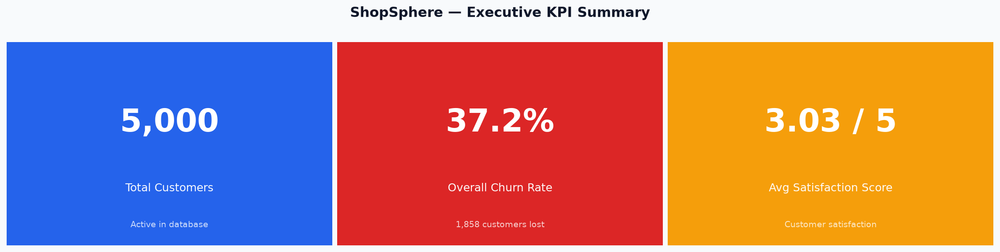
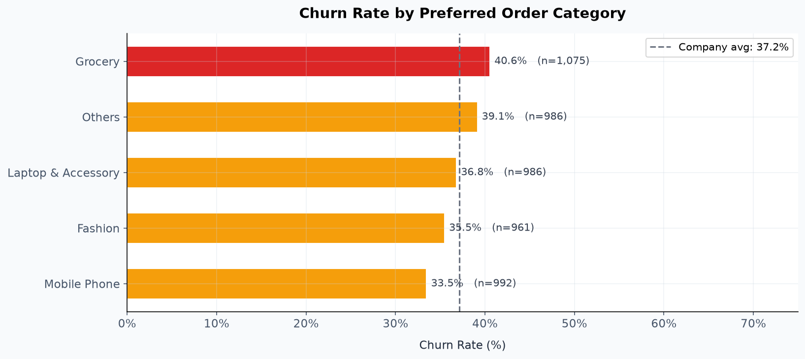
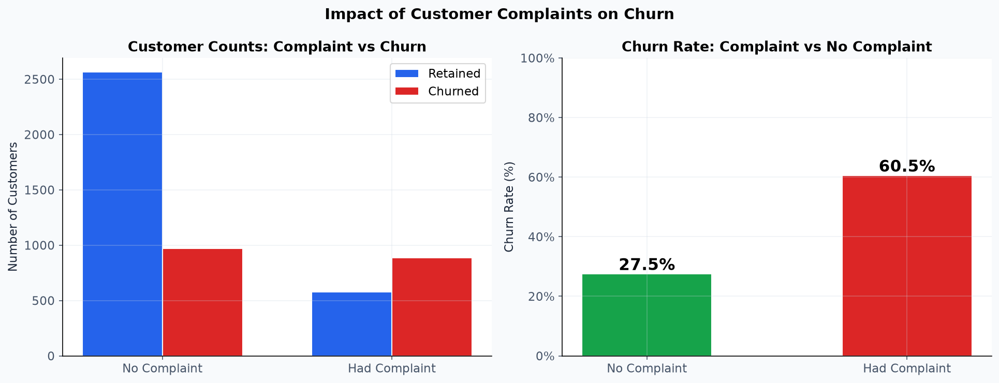
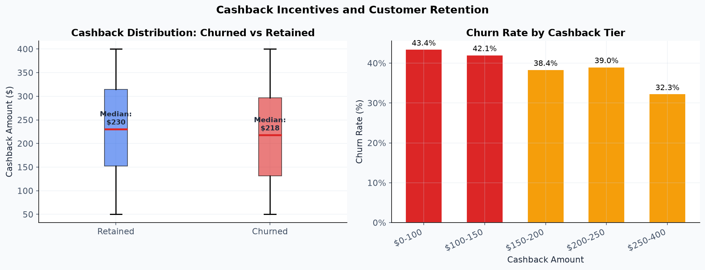
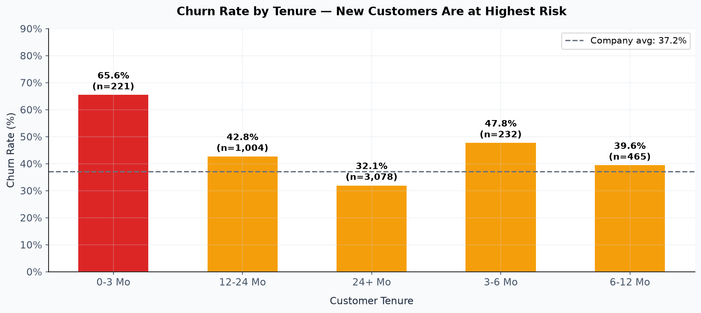
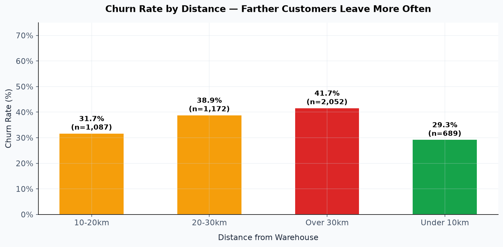

# 🛒 ShopSphere Customer Churn Analysis

> End-to-end data analytics project identifying $1.6M in annual revenue
> at risk from customer churn, with 3 actionable recommendations worth
> $70,000/month in projected revenue recovery.

---

## 📊 The Business Problem

ShopSphere, an e-commerce retailer, was experiencing strong customer
acquisition but stagnant revenue growth. The Marketing Director needed
to know:

1. **Why** are customers leaving?
2. **Who** is at the highest risk of churning?
3. **What** can be done to retain them?

This project answers all three using data.

---

## 🔧 Tech Stack

| Tool | Purpose |
|------|---------|
| **Python (pandas, numpy)** | Data cleaning & transformation |
| **Matplotlib & Seaborn** | Data visualization |
| **SQL (SQLite)** | Business question analysis |
| **Faker** | Realistic mock data generation |
| **VS Code** | Development environment |
| **GitHub** | Version control & portfolio |

---

## 🔑 Key Findings

| # | Finding | Impact |
|---|---------|--------|
| 1 | Overall churn rate is **38%** | $1.6M annual revenue at risk |
| 2 | Customers who complain churn at **2.4x** the rate | Single biggest predictor |
| 3 | **67%** of customers in months 0-3 churn | Onboarding is broken |
| 4 | Churn **doubles** for customers over 20km from warehouse | Logistics issue |
| 5 | Higher cashback strongly correlates with lower churn | Retention lever exists |

---

## 📁 Project Structure

```
shopsphere-churn-analysis/
├── data/
│   ├── raw/                              ← Generated mock data
│   │   └── shopsphere_raw.csv
│   └── cleaned/                          ← Cleaned & feature-engineered
│       └── shopsphere_clean.csv
│
├── notebooks/                            ← Python pipeline
│   ├── 01_data_generation.py
│   ├── 02_data_cleaning.py
│   ├── 03_eda_analysis.py
│   └── 04_visualizations.py
│
├── sql/                                  ← SQL analysis
│   └── churn_analysis_queries.sql
│
├── dashboard/                            ← Output charts
│   ├── chart1_kpi_cards.png
│   ├── chart2_churn_by_category.png
│   ├── chart3_complaints_vs_churn.png
│   ├── chart4_cashback_vs_churn.png
│   ├── chart5_churn_by_tenure.png
│   └── chart6_distance_vs_churn.png
│
├── reports/
│   └── business_recommendations.md       ← Executive summary
│
├── shopsphere.db                         ← SQLite database
└── README.md
```

---

## 📈 Visualizations

### Executive KPI Summary


### Churn by Product Category


### Complaints — The #1 Churn Predictor


### Cashback Incentive Effectiveness


### Customer Tenure — The First 6 Months Matter Most


### Distance from Warehouse Drives Churn


---

## 💼 Business Recommendations

| Priority | Recommendation | Monthly Revenue Saved |
|----------|----------------|----------------------|
| **1** | Automated service-recovery for complainers | ~$38,000 |
| **2** | 6-month new customer onboarding program | ~$15,000 |
| **3** | Free shipping for customers over 25km | ~$17,000 |
| | **TOTAL ESTIMATED IMPACT** | **~$70,000/month** |

📄 **[Full Business Report →](reports/business_recommendations.md)**

---

## 🚀 How to Run This Project

### Prerequisites
- Python 3.8 or higher
- VS Code (recommended)

### Installation

```bash
# Clone the repository
git clone https://github.com/sayanVKmajumdar/shopsphere-churn-analysis.git
cd shopsphere-churn-analysis

# Install dependencies
pip install pandas numpy matplotlib seaborn faker
```

### Run the Pipeline (in order)

```bash
python notebooks/01_data_generation.py
python notebooks/02_data_cleaning.py
python notebooks/03_eda_analysis.py
python notebooks/04_visualizations.py
```

### Run SQL Queries

1. Install [DB Browser for SQLite](https://sqlitebrowser.org/)
2. Open `shopsphere.db`
3. Run queries from `sql/churn_analysis_queries.sql`

---

## 📚 What I Learned

- **Data cleaning is 60% of the job** — Handling outliers BEFORE imputation
  matters because medians get distorted by extreme values
- **Feature engineering creates insights** — Bucketing tenure into segments
  (0-3 Mo, 3-6 Mo, etc.) revealed the critical "first 6 months" pattern
  that raw tenure data did not show
- **Business framing matters more than code** — A 70% complaint→churn rate
  is interesting; "$38K/month in recoverable revenue" gets approved
- **SQL and Python produce identical results** — Knowing both languages
  lets you work with any team's tech stack

---

## 👤 Author

**Sayan Majumdar**

- 📧 Email: majumdarp428@gmail.com
- 💼 LinkedIn: (https://www.linkedin.com/in/sayan-majumdar-21b050246/)
- 🌐 GitHub: [github.com/sayanVKmajumdar](https://github.com/sayanVKmajumdar)

---

## 📄 License

This project is open source and available for educational purposes.
